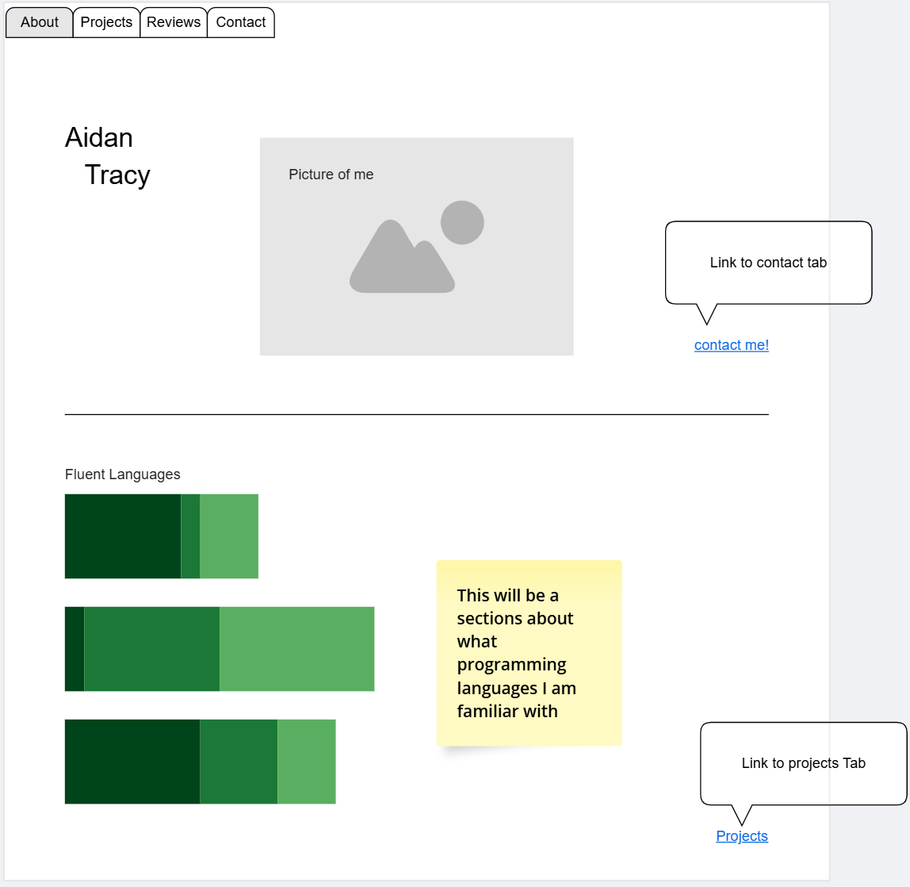
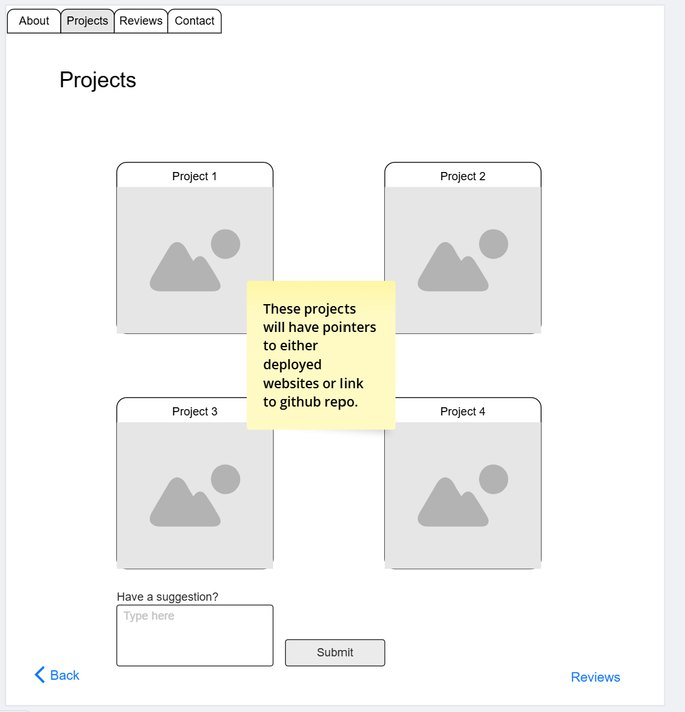
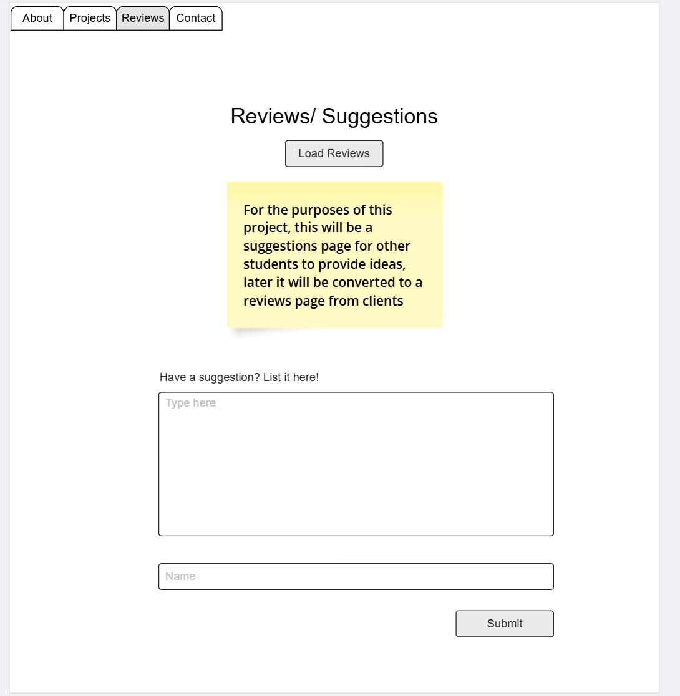
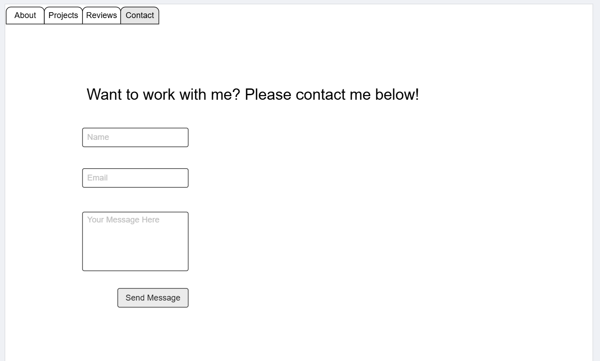

# CS408 Final Project - Aidan Tracy
# Portfolio Website Project: Personal Portfolio

### Project Overview and Theme:
This project will be a Personal Portfolio Website aimed at showcasing my skills, experience, and projects in web development. With an emphasis on a visually appealing, modern design, the portfolio will serve as a central hub for potential employers, collaborators, and clients to learn about my background and engage with my work. Utilizing AWS DynamoDB for the backend and database, the project will highlight a full-stack development approach that incorporates dynamic, data-driven elements and smooth user interaction.

### Functionality and Features:
The portfolio will not only serve as a resume but will also feature interactive elements that provide a deeper insight into my work. Some key features include:

1. Home Page – A welcoming landing page introducing myself with a short bio, my current career highlights, and links to other sections of my portfolio.

2. Projects Page – This page will showcase a detailed list of personal projects, including descriptions, technologies used, links to live demos (eventually), and GitHub repositories. The project data will be stored in DynamoDB and fetched dynamically, allowing me to add new projects without altering the frontend code.

3. Blog Page/Suggestions – This section will feature a blog where I can post updates, tutorials, and thoughts on web development and tech topics. Each post will be stored in DynamoDB and dynamically loaded into the front end.

4. Contact Form – A contact page that will feature a form for visitors to reach out to me with inquiries or collaboration requests. The form submissions will be stored in DynamoDB and optionally routed to my email.

5. Resume Download – A downloadable PDF of my resume for quick reference.

### Target Audience:
The website is aimed primarily at potential employers, clients, and collaborators who want to understand my skill set and experience. It will also appeal to fellow developers who may wish to learn from or contribute to my projects, as well as students.

### Data Management:
AWS DynamoDB will manage all dynamically generated data, including:
   - Project Data: Each project entry will store title, description, technologies used, and URLs to demos and repositories. This data will be dynamically rendered to the Projects page.
   - Blog Posts: Each post entry will store content, date, tags, and an optional cover image link, allowing me to expand the blog continuously.
   - Contact Form Submissions: Contact form entries will be stored with sender information (name, email, and message) and timestamp for tracking interactions.
   - Visitor Activity and Notifications: Tracking which projects or blogs are viewed most frequently, allowing me to tailor my portfolio and optimize content based on engagement (ideally before deployment).

### Stretch Goals and Future Enhancements:
For added functionality and visual appeal, I plan to implement several stretch goals:

1. Search and Filter for Projects and Blogs – Enabling visitors to search and filter through my projects and blog posts based on tags, categories, or keywords.
2. Admin Panel for Managing Content – Building an admin interface to manage project, blog, and contact data directly from the website, streamlining updates.
3. Visitor Analytics Dashboard – Setting up analytics tracking for views, clicks, and engagement on various pages, giving insights into visitor behavior and content popularity.
4. Dark/Light Mode Toggle – Adding a theme toggle for a personalized visitor experience.

### Conclusion:
This portfolio project will combine a visually appealing frontend with a dynamic, data-driven backend to create a fully functional showcase of my work. By utilizing AWS DynamoDB, the website will be easily extendable and manageable, with potential for ongoing updates and growth. The stretch goals will add an extra layer of interactivity and engagement, making this portfolio a versatile platform for professional representation.

## Project Wireframe

TODO: Replace the wireframe below with you own design.

